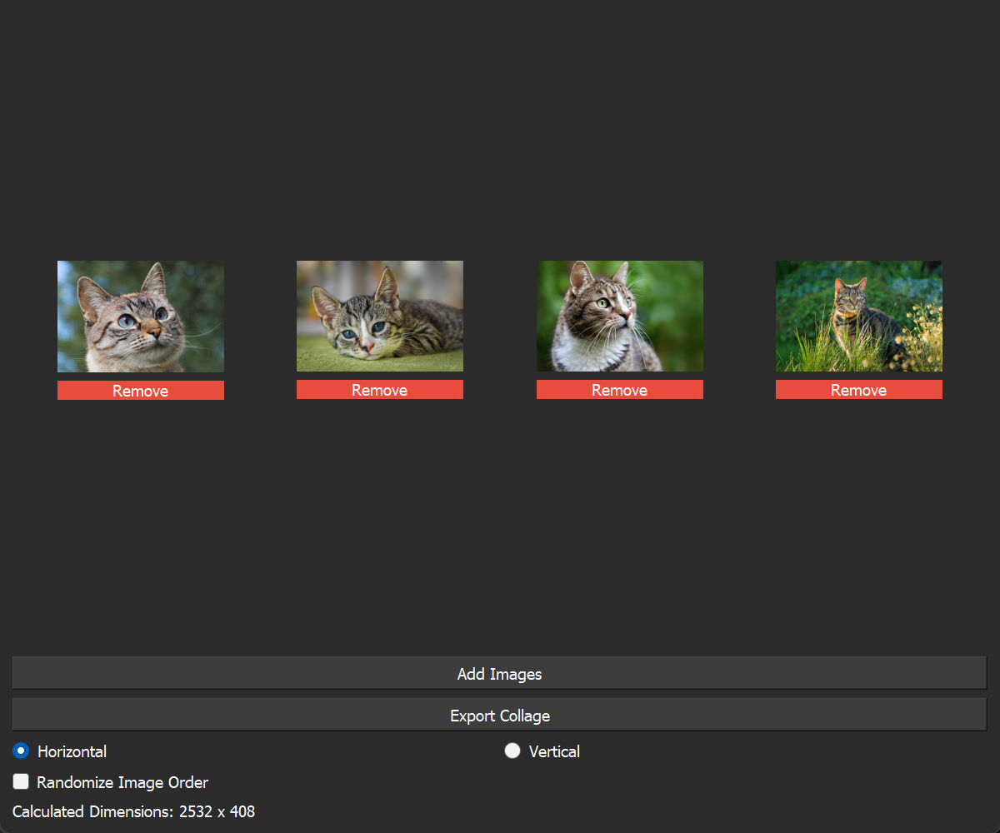
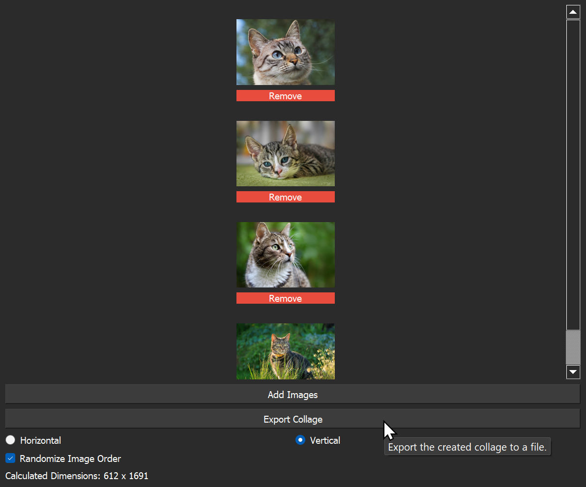

# py-image-stitcher

A small desktop utility written in Python for quickly combining multiple images into a single stitched image. Supports both a graphical interface built with PyQt5 and a lightweight command-line interface for scripting or batch usage.

## Features

- Stitch images horizontally or vertically
- Automatic image resizing while preserving aspect ratio
- Optional image order randomization
- Timestamped export filenames
- Dark-themed PyQt5 interface
- Command-line support for automation and scripting

## Screenshots

_Demonstration of the basic functionality._

_Configurable orientation and toggles._

## GUI Usage

Running the program normally launches the graphical interface:

    python main.py

Inside the GUI you can:

- Add multiple images
- Preview them before exporting
- Switch between horizontal and vertical stitching
- Rearrange image order using arrow buttons
- Randomize image order before export

Exported files are automatically saved with a timestamped filename such as:

    collage-20260513-143055.jpg

## CLI Usage

The project also supports a command-line mode for faster workflows or scripting.

Basic usage:

    python main.py image1.jpg image2.jpg image3.jpg

Example with additional arguments:

    python main.py image1.jpg image2.jpg --vertical --randomize -o final.jpg

You can use the `--help` arg to see a complete list of supported arguments and what they do.

## Dependencies

- Python 3.10+
- PyQt5
- Pillow

Install dependencies with:

    pip install PyQt5 Pillow

## License

This project is licensed under the MIT License.

See the [LICENSE](LICENSE) file for details.
